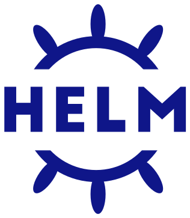

class: middle, center

# Cambiar con Confianza 
### Lecciones Aprendidas de Helm 3
##### Taylor Thomas - Ingeniero Senior del Software en Microsoft Azure

.footnote[DevOpsDays Guadalajara 2020]

???
- Tomen en cuenta que no necesitan ningún conocimiento de Helm para sacar algún
  beneficio de este discurso. Explicaré mas en un rato

---
# ¿Quién soy yo?

- Ingeniero Senior del Software en Microsoft Azure
- Mantenedor Principal de Helm
- GitHub: [@thomastaylor312](https://github.com/thomastaylor312)
- Twitter: [@_oftaylor](https://twitter.com/_oftaylor)
- Kubernetes Slack: @oftaylor

???

- Soy un ingeniero del Software en Azure enfocado en Helm, pero también con
  otros proyectos de código abierto. También trabajaba en AKS antes.
- Entonces, ¿por qué deben escuchar a lo que voy a decir?
- He sido un mantenedor principal de Helm por 3 años
- Hice mucho trabajo con Helm 3, tal como programar y planificar todo el proceso
  de lanzamiento con los otros mantenedores

---
# Agenda

- ¿Qué es Helm?

- El Feo

- El Malo

- El Bueno

---
# ¿Qué es Helm?

.left-column[
- El administrador de paquetes para Kubernetes

- Mas de 1 millón de descargas por mes

- Muchas compañías grandes lo usan en producción

- Lanzamos Helm 3 en Noviembre de 2019, nuestra primera versión mayor en mas de
  dos años
]

.right-column[
.middle[]
]

???
- ¿Cuántos han escuchado de Helm? ¿Lo han usado?
- Todo esto significa que habríamos podido tener un gran impacto en muchas
  compañías si no hubieramos hecho buen trabajo con la nueva versión. También no
  podríamos quebrantar los paquetes que ya existían porque no queríamos que
  nuestros usuarios tuvieran que cambiar todo para acutalizar
- Y esto es todo que se requiere saber de Helm. Es un buen ejemplo de un
  proyecto que impacta a muchas personas y las lecciones que aprendimos durante
  nuestro trabajo en Helm 3. Espero que puedan aprender de nuestras
  equivocaciones y lo que hicimos bien.

---
# El Feo

.left-column[
- Funciones que no necesitamos
]

.right-column[
.middle[]
]

???
- Creo que el mejor ejemplo de esto fue lo que pasó con Lua. Pensamos en tener
  Lua integrado en Helm para que los usuarios avanzados pudieran tener un
  lenguaje real para hacer lo que querían. Eso llevó a mucha confusion en la
  communidad y demoras con el proyecto. 
- También pensamos en re-diseñar muchas partes del código para que fueran mas
  fácil mantener. Pero también eso nos demoró porque no pudimos continuar con la
  ayuda de la comunidad sin tener esa fundación y las interfaces programáticas.
--
.left-column[
- Falta de personas
]

???
- Tal vez este punto les parece un poquito interesante, pero fue algo muy "feo"
  que aprendimos. Al empezar, solo 2 (o tal vez 3) tabajaban en Helm 3.
  Eventualmente, llegamos a tener muchos mas. Eso fue, en parte, debido a otras
  equivocaciones nuestras, pero también había falta de personas con tiempo. Hay
  que recordar que esto no solo pasa con proyectos de código abierto, sino
  también en proyectos de empresas.
---
# Lecciones

- Tomar el tiempo al principio para averiguar lo que necesitan sus usuarios

???
- Aunque algo parece muy útil, tal vez no sea necesario. También pueden hacerlo
  mas tarde si es posible. Con Helm, aprendimos con rapidez que la "función" que
  mas queían era retirar Tiller. Como dije antes, aprendimos esto con Lua. Era
  algo muy interesante que podría haber sido muy util para los usuarios
  avanzados de Helm, pero el trabajo necessario fue demasiado grande. Si lo
  hubieramos hecho, tal vez no tendríamos Helm 3 todavía.
--

- Cuidar a su gente

???
- Solo 2 o 3 personas podian trabajar y estaban quemandose (burning out). Si
  quieren que su proyecto sea exitoso, tienen que cuidar a su gente y tener un
  numero suficiente de personas para el proyecto. No puedo decir demasiado de
  este punto. En caso de Helm, casi todos los mantenedores que trabajaban en
  Helm 3 murieron de estrés por tener que contestar todas las preguntas de la
  communidad al mismo tiempo en trabajar con el código. Con codigo abierto,
  recuerden que los mantenedores son personas también y no existen para hacer lo
  que quieren. Y, en contexto de proyectos de sus empresas, recuerden que sus
  empleados harán su mejor trabajo cuando los tratan bien.

---
# El Malo

.left-column[
- Trabajo con un único subproceso (single threaded)
]

.right-column[
.middle[]
]

???
- Porque habían tantos cambios requeridos para el código, decidimos que solo los
  mantenedores principales podían trabajar durante la primera parte del
  proyecto. Con todo honestidad, no sé si había otra manera de hacerlo en
  nuestro caso, pero la decisión nos causó muchos problemas. Tales como esa
  falta de personas que mencioné con las "cosas feas" y un retraso del proyecto.
- Tengo sentimientos encontrados en cuanto a esta decisión. De un lado, nos
  ayudó tener código mas organizado, pero del otro lado, nos causó estos
  problemas mencionados.
--
.left-column[
- Confusión y falta de claridad de como la comunidad podían ayudar
]

???
- Este punto es relacionado con el primero. Por causa de nuestro trabajo con un
  único subproceso los contribuidores tenían que aprender la mayoría del código
  de nuevo. También con la falta de mantenedores, no nos comunicamos bien acerca
  de nuestra plan aun después de terminar la primera parte del trabajo. Hablamos
  en público en cuanto a nuestros planes, pero no organizamos bien nuestro
  GitHub hasta el verano de 2019. Con todo esto, había mucha confusión entre los
  integrantes de la comunidad hasta 2 o 3 meses antes del lanzamiento
---
# Lecciones

- Estructurar su trabajo para evitar "trabajo con un único subproceso"
  - Mantengan sus pull requests y tareas lo mas enfocado y pequeño que sea
    posible
  - Organizar su proyecto bien desde el principio
  - Tener más versiones mayores en seguida en vez de una version mayor muy
    grande cada pocos años

???
- A veces, es impossible evitar esto, pero esfuercense por encontrar una
  organización de tareas que facilite trabajo paralelo. Algunos ideas:
  - Nuestra equivocación fue organizar nuestras tareas demasiado tarde en el
    proceso
  - Si es posible, consideren tener mas versiones mayores en seguida en vez de
    una version mayor muy grande cada pocos años. Esto es algo que hemos
    empezado considerar como mantenedores de Helm
--

- Comunicar antemano los cambios planificados 

???
- Esto significa comunicarlo de todos las maneras posibles. Slack, correo
  electronico, GitHub, etc. Yo sé que es una molestía, pero es sumamente
  importante comunicarse. Si sus usuarios tienen el mapa vial, pueden prepararse
  para los cambios y planificar el trabajo que ellos tienen que hacer para
  adoptar los cambios que Uds. hacen. Para mi, si alguien me informa con
  antelación lo que van a hacer, eso me hace muy feliz y tengo mas paciencia con
  los problemas y equivocaciones que inevitablemente vendrán.
---
# El Bueno

.left-column[
- Migración
]

.right-column[
.middle[]
]

???
- Aunque habían cosas malas, todavía hay muchas cosas buenas!
- Una de las cosas que hicimos muy bien fue la migración. Al lanzar Helm 3,
  tambien lanzamos un plugin para migrar los datos e información de Helm 2 a
  Helm 3. En ninguna manera es perfecto, pero ha funcionado bien para la mayoría
  de nuestros usuarios.
--

.left-column[
- Compatibilidad con versiones anteriores
]

???
- Logramos compatibilidad con Helm 2 con la mayoría de funciones y tenemos bien
  documentado las excepciones. Tambien se puede usar las 2 versiones juntos sin
  tener problemas.
--

.left-column[
- Buen período de Alpha y Beta
]

???
- Tuvimos 3 meses de Alpha y Beta. Con este tiempo proyectos que dependen de
  Helm tuvieron el tiempo para hacer cambios y nos dieron feedback. Con todo ese
  tiempo, la comunidad encontró muchos de los problemas que quedaban y pudimos
  resolverlos.
--

.left-column[
- Apoyo para un año
]

???
- Algo más que decidimos hacer fue apoyar Helm 2 por un año mas después del
  lanzamiento de Helm 3. Hay muchas empresas grandes que no pueden adoptar or
  usar la versión mas nueva. Para ayudar a estos usarios tener el tiempo para
  cambiar, extendimos el tiempo de apoyo a un año
---
# Lecciones

- Facilitar migración

  - Herramientas
  - Guías _detalladas_
  - Apoyar la versión previa

???
- Hacer todo lo posible para asegurar que el proceso de cambiar sea _fácil_. Si
  sus usuarios tienen que hacer 15 pasos distintos, no les va a gustar y, mas
  importantemente, habrán errores que tal vez impacten producción. Les puede
  ganar el respeto y confianza de sus usuarios si hacen que el proceso de
  actualizar sea fácil y seguro. Esta confianza hace que sus trabajos sean mas
  fáciles y que puedan hacer mas cambios en el futuro.
--

- Tener Alpha y Beta
  - Cultivar una lista de "power users" y otros usuarios que quieran usar "la
    cosa mas nueva"
  - Comunicar y dar tiempo suficiente para que sus usuarios tengan el tiempo
    para probarlo
???
- Una aclaración: esto no significa algo como blue/green or canary, es un tiempo
  en que sus usuarios pueden optar por probar la nueva versión
- De nuevo, la comunicación es esencial 
--
- Tener un plan de apoyo y deprecación

???
- No pueden suponer que todos puedan adoptar la nueva versión de imediato.
  Siempre hay que tener un período en que pueden probarlo y hacer los cambios
  necesarios 
---
class: middle, center
# ¿Preguntas, dudas, o aclaraciones?

---
class: middle, center
# ¡Muchas gracias!
https://slides.oftaylor.com/CambiarConConfianza
