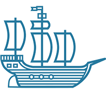

class: center, middle

# DeisLabs: What's Cooking
#### Taylor Thomas - Senior Software Engineer at Microsoft Azure
.bottom[]
---
# Who am I?

- Senior Software Engineer in Microsoft Azure
- Helm Core Maintainer
- GitHub: [@thomastaylor312](https://github.com/thomastaylor312)
- Twitter: [@_oftaylor](https://twitter.com/_oftaylor)
- Kubernetes Slack: @oftaylor

???

- I'm a software engineer at Azure primarily working on the DeisLabs team (I'll
  explain what team that is in just a second). I used to work on AKS as well
- So why listen to me?
- I am in a lucky position where I work on Open Source and Microsoft so happens
  to pay me
- I have been involved in this whole "Cloud Native" thing since almost the
  beginning and I enjoy helping people out. So what I talk about today will be
  focused on some of the open source projects my team is working on, but maybe
  they aren't the best technology choice for you. But I still hope you'll learn
  something from us and our experience. Feel free to ask me about any
  technologies and I will give you my best educated opinion about them

---
background-image: url(assets/phippyandfriends.tiff)
background-size: contain
# What is this DeisLabs thing?

???
- Deis Labs is a shoutout to Deis, the organization where many of us started our
  journey into Kubernetes and Open Source. If you hadn't heard of Deis, it was a
  startup working on Kubernetes and containers tooling and was acquired by
  Microsoft. Most of us have been doing for a while
- Some of the people on this team created Phippy and some of the other
  characters showed here
- Our goal is to create great open source software and build healthy, diverse
  communities for those projects
- Most people, when they hear about Microsoft doing open source, are fairly
  skeptical. I've had plenty of people come up to me and quote the whole
  "Embrace, Extend, Extinguish" thing. But what I love about our team is that
  our primary goal is running open communities. Most of our projects are
  technically owned by the CNCF and worked on by many other companies. Like I
  said before, I am going to talk about some of our projects and how they can
  help you, but I will give you honest opinions about our own projects and will
  talk about any other technologies that interest you

--

.middle[
.center[
## https://deislabs.io
## https://github.com/deislabs
]
]

???
- You can find most of our projects or more information at these links

---
# The Menu

- Appetizers
  - Helm
  - Brigade
  - CNAB
  - Porter
  - VS Code Extensions
- Palate Cleanser: The Future
- Main Course: Your Choice or Chef's Choice

???
- Ok, I know this is a terrible dad joke/pun on the title of the talk but I
  couldn't help myself
- I am going to do a talk that is probably a bit different than you are normally
  used to. I am going to give a brief overview about what each of these projects
  are and how they can help you. Then I'll give a brief look at the future
  projects to keep an eye out for and then we are going to do a "choose your own
  adventure." If there is a topic I mentioned that is of interest to most of
  you, we'll dig some more into it. Otherwise, if no one feels like any specific
  topic, I'll dive in to something I think could be helpful to the most amount
  of people
- Because of the flexible nature of this, feel free to ask a question at any
  time!

---
class: center, middle
# Appetizers

---
background-image: url(./assets/helm.svg)

???
- How many of you have heard of Helm? How many have used it?
- And just out of curiosity, how many of you have gotten waaaaay to deep into it?

---
class: center, middle
## The package manager for Kubernetes
#### Helm is the best way to find, share, and use software built for Kubernetes

.center[
### https://helm.sh
]

---
# Helm
- What is Helm?
- How and why do people use it?

.footnote[.center[https://helm.sh]]

???
- So let's talk Helm. What’s Helm and why do people use it? It’s a package
  manager like Homebrew, apt, and yum. 
- Helm is now a CNCF (Cloud Native Computing Foundation) incubating (and
  hopefully soon graduating) project - we donated the IP to the CNCF. 
- At Microsoft, we use Helm in AKS, azure dev spaces, azure pipelines, azure
  devops, and a whole host of other internal products
- But let's talk a bit more about why Helm could be useful for you

---
# Helm
.left-column[
.center[

#### Manage complexity

#### Simple sharing
]
]

.right-column[
.center[

<h4 style="padding-bottom: 33px; margin-top: -17px;">Easy updates</h4>

#### Rollbacks
]
]

.footnote[.center[https://helm.sh]]

???
NOTE: Depending on how many people are really experienced with Helm, this could
be trimmed or skipped
- As you can see here, these are 4 of the biggest things Helm can help you with
  (though there are many more useful features). So let's dig into each one
- Manage complexity: Charts can describe complex apps; provide repeatable app
  installs, and serve as a single point of authority
- Easy updates: Take the pain out of updates with in-place upgrades and custom
  hooks. Basically, you can manage all of the Kubernetes lifecycle of your app
  with Helm (please note that we can't manage all of your app for you :D)
- Simple sharing: Charts are easy to version, share, and host on public or
  private servers. Also, with the release of Helm 3, we also have library
  charts, which are reusable components/templates that can be shared to reduce
  copy/pasting
- Rollbacks: This is related to the easy updates, but you also get the ability
  to rollback. You fat finger a config value or accidently deploy a bug? It is
  as simple as `helm rollback`
- Something else to know is that Helm is easily extendible using plugins or the
  Go SDK

---
background-image: url(./assets/brigade.svg)

???
Brigade is event driven scripting for Kubernetes. Kubernetes is a declarative
system; everything you define is the desired state and reconciled by
controllers... but what if you need to do some things based on events? If this,
then do that... workflow engine stuff... what do you do? Enter Brigade. 

---
class: center, middle
## Run scriptable, automated tasks in the cloud — as part of your Kubernetes cluster

### https://brigade.sh

???
The overly simple explanation is that Brigade is a Kubernetes native Thing Doer™

---
# Brigade
.left-column[
.center[

### Simple, powerful pipes
]
]

.right-column[
.center[

### Runs inside your cluster
]
]

.footnote[.center[https://brigade.sh]]

???
- So let's dig in to what it actually is. The more complex explanation is that
  it’s a JavaScript runtime - you can define complex pipelines in Brigade and
  model any arbitrary workflow that you want to in Javascript.
- Simple pipes: Each project gets a brigade.js config file, which is where you
  can write dynamic, interwoven pipelines and tasks for your Kubernetes cluster
- Runs in cluster: By running Brigade as a service inside your Kubernetes
  cluster, you can harness the power of millions of available Docker images
  - Think automation, open source, in-cluster developer-friendly operations tool
    with a one-line helm install. If you are building a platform on top of
    Kubernetes, this can be extremely useful for you for automating operations
    and deployments

---
background-image: url(./assets/cnab.svg)

???
- Cloud Native Application Bundles -> CNAB

---
class: center, middle
## Spec for packaging distributed apps

### https://cnab.io

???
- CNAB bundles facilitate the bundling, installing and managing of
  container-native apps — and their coupled services. So if you need to lay down
  some infrastructure first and then configure a few data bases, and run some
  configuration scripts, you can put that all into a bundle, which is then kinda
  like a good old installer on your computer
- One of my favorite things about this project is it is completely cloud
  agnostic. It is not some Microsoft specific thing. In fact, this spec was
  written in collaboration with other companies. A CNAB bundle can be composed
  to utilize whatever infra or services you require - there’s no vendor lock in.
- CNAB bundles can be used to easily deliver apps across teams, organizations
  and marketplaces - even shared offline. One of the questions we've heard a lot
  of is about using it for airgapped environments, meaning no internet
  connection. Bundles can be built so everything they need to run is inside of
  it (called a thick bundle).
- A CNAB bundle can be cryptographically signed, attested, and verified to
  ensure a trustworthy source, which is useful for the aforementioned airgap
  situations.

---
background-image: url(./assets/porter.png)

???
- Porter is a tool for managing, create, and installing your Bundles. CNAB is
  the spec, Porter is an implementation
- Porter makes using CNAB easier - it’s a declarative bundle builder. When we
  deploy to the cloud, most of us aren’t dealing with just a single cloud
  provider or toolchain. The simplest of applications today need nginx, Let’s
  Encrypt, persistent file storage, DNS, and somewhere in there is your
  application. One app is installed with Helm, another with the cloud provider’s
  cli and it’s all glued together with magic bash scripts. That is a lot to
  figure out and put together yourself. So let's go into a few details.

---
# Porter
- Install your app and its baggage
- Mixins!
- Dependency and package management

.center[
### https://porter.sh
]

???
- Bundle up not just the app, but everything it needs to run in the cloud. Like
  I mentioned before, this bundle can pull down all the images and resources
  needed to manage the bundle
- Mixins are various actions that can be performed. You can use
  mixins for common tools and clouds
- You can package up and version your bundle and distribute it for others to use
  with tools like an OCI registry
- To emphasize this again: this is completely open and not tied specifically to
  Azure. There are mixins for most cloud providers and several common cloud
  tools. We even have a demo using Terraform and Digital Ocean with Porter
  bundles

---
# VS Code Extensions
- View and manage Kubernetes clusters
- Build and run containers from Dockerfiles
- Intellisense for Kubernetes & Helm resources
- Works anywhere (Azure, Minikube, KIND, AWS, GCP, etc)

.center[
### https://azure.github.io/vscode-kubernetes-tools/
]

???
- One that people generally are surprised that we work on are the Kubernetes
  tools for VS Code. Out of curiosity, how many people here use VS Code?
- Once again: If you worry about using Microsoft things, there is no need to
  worry. Everything here works with _any_ Kubernetes cluster. The goal here was
  to have a solid set of tools to make people's lives easier

---
layout: false
# The Future
.left-column[
- WASM
- More Rust
- [Brigade 2.0!](https://github.com/brigadecore/brigade/issues?q=is%3Aissue+is%3Aopen+label%3A2.0)
- CNAB 1.1 (and maybe 2.0?) Spec
  - [CNAB Declarative Installation](https://github.com/cnabio/cnab-spec/issues/285)
]
.right-column[
.middle[]
]

???
- These are some of the things we are investigating or working on (I've added
  links where I can)
- We are starting to use and/or contribute more to various Rust projects.
- The declarative stuff is really interesting because it is about making a spec
  that knows more about what is going to happen inside the bundle, whereas right
  now it doesn't know what is going on inside

---
# Main Course

What interests you? Any topics or projects sound interesting?

---
class: center, middle
# Thank you!

https://slides.oftaylor.com/DeisLabsWhatsCooking/
